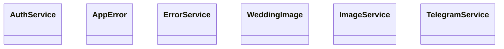

# 📁 Services Directory

[Root](/.) / [frontend](/frontend) / [src](/frontend/src) / [shared](/frontend/src/shared) / [services](/frontend/src/shared/services)

## 🎯 Purpose
Delivering luxury-tier architectural components and high-performance logic for the **services** domain. This directory is a crucial part of the Mavluda Beauty full-stack ecosystem, ensuring seamless scalability, robust performance, and an elite digital experience.
**FSD Layer:** Shared


## 🏗️ Architecture


## 📄 File Registry
| File Name | Type | Responsibility | Key Aliases Used |
|---|---|---|---|
| `auth.service.ts` | File | Encapsulates business logic and data access for auth.service.ts. | @angular/common/http, @core/constants, @shared/models, @angular/core, @angular/router |
| `error.service.ts` | File | Encapsulates business logic and data access for error.service.ts. | @angular/core |
| `image.service.ts` | File | Encapsulates business logic and data access for image.service.ts. | @angular/core |
| `index.ts` | File | Provides core logic and orchestration for index.ts. | N/A |
| `telegram.service.ts` | File | Encapsulates business logic and data access for telegram.service.ts. | @src/types/telegram, @angular/core |

## 🔗 Dependencies
- Relies on internal Mavluda Beauty architecture and designated FSD layers.
- See 'Key Aliases Used' in the File Registry for explicit cross-domain references.

## 🛠️ Usage
```typescript
// Example usage within the Mavluda Beauty ecosystem
import { relevantMember } from './core';

// Integrate into the application architecture
relevantMember.execute();
```
