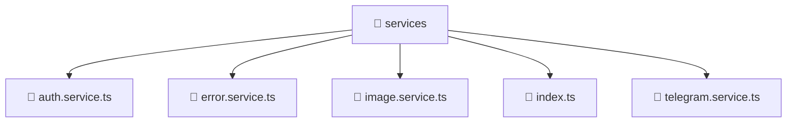

# 📁 Mavluda Beauty services

[frontend](/frontend) / [src](/frontend/src) / [shared](/frontend/src/shared) / [services](/frontend/src/shared/services)

## 🎯 Purpose
Delivering luxury-tier architectural components and high-performance logic for the **services** domain. This directory is a crucial part of the Mavluda Beauty full-stack ecosystem, ensuring seamless scalability, robust performance, and an elite digital experience.

> **FSD Layer**: `Shared` - Adhering to Feature Sliced Design principles.

## 🏗️ Architecture


## 📄 File Registry
| File Name | Type | Responsibility | Key Aliases Used |
|---|---|---|---|
| `auth.service.ts` | Service | Encapsulates business logic and API calls. | `@angular/common/http, @angular/core, @angular/router, @core/constants, @shared/models` |
| `error.service.ts` | Service | Encapsulates business logic and API calls. | `@angular/core` |
| `image.service.ts` | Service | Encapsulates business logic and API calls. | `@angular/core` |
| `index.ts` | TypeScript Logic | Core logic and utilities for this domain. | N/A |
| `telegram.service.ts` | Service | Encapsulates business logic and API calls. | `@angular/core, @src/types/telegram` |


## 🔗 Dependencies
**Path Aliases:**
- `@angular/common/http`
- `@angular/core`
- `@angular/router`
- `@core/constants`
- `@shared/models`
- `@src/types/telegram`

**External Packages:**
- `rxjs`


## 🛠️ Usage
```typescript
// Example integration for services
// Import capabilities from this directory to enrich your modules.
```
> This directory provides specialized logic tailored to the Mavluda Beauty standard.
