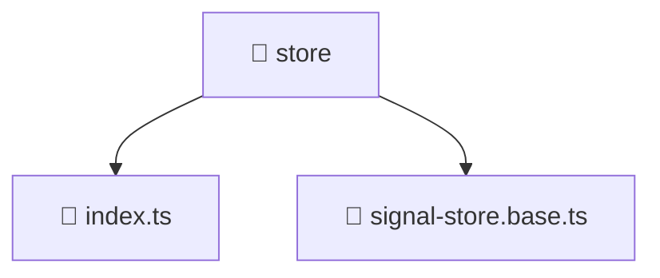

# 📁 store

[Root](/.) > [frontend](/frontend) > [src](/frontend/src) > [shared](/frontend/src/shared) > [store](/frontend/src/shared/store)

**FSD Layer:** Shared

## 🎯 Purpose
State management logic, actions, reducers, and selectors for global or feature state.

## 🏗️ Architecture


## 📄 File Registry
| File Name | Type | Responsibility | Key Aliases Used |
|---|---|---|---|
| `index.ts` | TypeScript | Provides core logic and orchestration for index.ts. | N/A |
| `signal-store.base.ts` | TypeScript | Provides core logic and orchestration for signal-store.base.ts. | @angular |

## 🔗 Dependencies
- `@angular/core`

## 🛠️ Usage
```typescript
// Dispatch an action or select state from the store
this.store.dispatch(SpecificAction());
```
