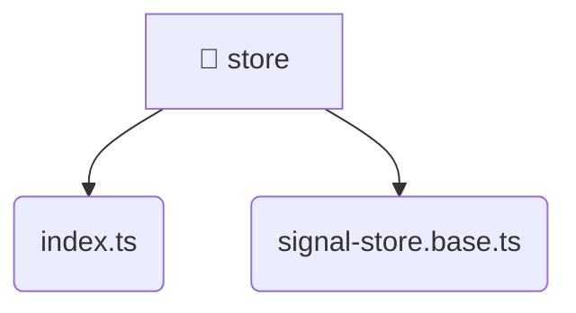

# [root](/) / [frontend](/frontend) / [src](/frontend/src) / [shared](/frontend/src/shared) / [store](/frontend/src/shared/store)

## 🏷️ 📁 Store

### 🎯 PURPOSE
The `store` directory forms a critical foundation within the Mavluda Beauty ecosystem, meticulously orchestrating the store logic to ensure a seamless and premium experience.

This directory resides within the **Shared** layer of our Feature Sliced Design (FSD) architecture, strictly adhering to Mavluda Beauty's robust separation of concerns.

### 🏗️ ARCHITECTURE


### 📄 FILE REGISTRY
| File Name | Type | Responsibility | Key Aliases Used |
|---|---|---|---|
| `index.ts` | `ts` | Core logic implementation. | None |
| `signal-store.base.ts` | `ts` | Core logic implementation. | @angular |

### 🔗 DEPENDENCIES
- `./signal-store.base`
- `@angular/core`

### 🛠️ USAGE
```typescript
// Seamlessly integrate store into your refined workflows:
import { /* exported members */ } from '@path/to/store';
```
