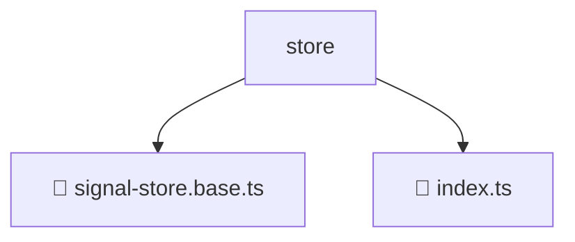

# 📂 STORE

> 💎 **Mavluda Beauty - Luxury Professional Architecture**

### 📍 Breadcrumb Navigation
`. > frontend > src > shared > store`

## 🎯 PURPOSE
This directory encapsulates `Shared` level functionality within the Mavluda Beauty ecosystem, ensuring proper separation of concerns and architectural transparency.

**FSD / Architecture Layer:** `Shared`

## 🏗️ ARCHITECTURE


## 📄 FILE REGISTRY

| Item Name | Type | Responsibility | Key Aliases Used |
|-----------|------|----------------|------------------|
| `📄 signal-store.base.ts` | `.ts` | General functionality | `@angular/core` |
| `📄 index.ts` | `.ts` | General functionality | `None` |

## 🔗 DEPENDENCIES
- `@angular/core`

## 🛠️ USAGE
```typescript
// Example usage context
import { ... } from './signal-store.base';

// Integrate signal-store.base logic into your feature.
```
