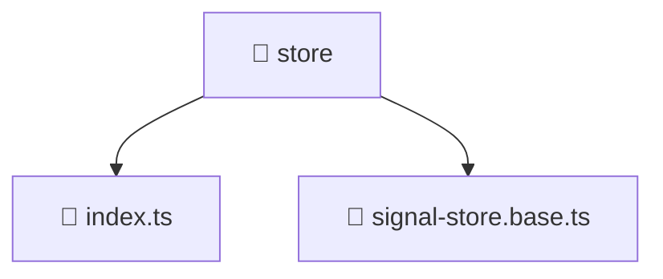

# 📁 Mavluda Beauty store

[frontend](/frontend) / [src](/frontend/src) / [shared](/frontend/src/shared) / [store](/frontend/src/shared/store)

## 🎯 Purpose
Delivering luxury-tier architectural components and high-performance logic for the **store** domain. This directory is a crucial part of the Mavluda Beauty full-stack ecosystem, ensuring seamless scalability, robust performance, and an elite digital experience.

> **FSD Layer**: `Shared` - Adhering to Feature Sliced Design principles.

## 🏗️ Architecture


## 📄 File Registry
| File Name | Type | Responsibility | Key Aliases Used |
|---|---|---|---|
| `index.ts` | TypeScript Logic | Core logic and utilities for this domain. | N/A |
| `signal-store.base.ts` | TypeScript Logic | Core logic and utilities for this domain. | `@angular/core` |


## 🔗 Dependencies
**Path Aliases:**
- `@angular/core`


## 🛠️ Usage
```typescript
// Example integration for store
// Import capabilities from this directory to enrich your modules.
```
> This directory provides specialized logic tailored to the Mavluda Beauty standard.
