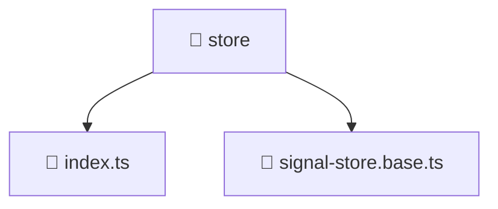

# 📁 store

[Root](/.) > [frontend](/frontend) > [src](/frontend/src) > [shared](/frontend/src/shared) > [store](/frontend/src/shared/store)

## 🎯 Purpose
Delivering luxury-tier architectural components and high-performance logic for the **store** domain. This directory is a crucial part of the Mavluda Beauty full-stack ecosystem, ensuring seamless scalability, robust performance, and an elite digital experience.

## 🏗️ Architecture


## 📄 File Registry
| File Name | Type | Responsibility | Key Aliases Used |
|---|---|---|---|
| `index.ts` | TypeScript | Handles logic and definitions for index.ts | None |
| `signal-store.base.ts` | TypeScript | Handles logic and definitions for signal-store.base.ts | @angular/core |

## 🔗 Dependencies
- `@angular/core`

## 🛠️ Usage
```typescript
// Example usage within the Mavluda Beauty ecosystem
import { relevantMember } from './store';

// Integrate into the application architecture
relevantMember.execute();
```
