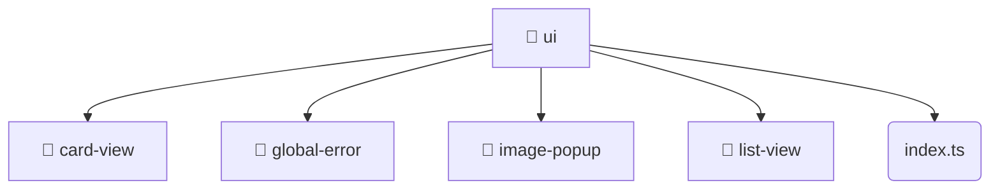

# [root](/) / [frontend](/frontend) / [src](/frontend/src) / [shared](/frontend/src/shared) / [ui](/frontend/src/shared/ui)

## 🏷️ 📁 Ui

### 🎯 PURPOSE
The `ui` directory forms a critical foundation within the Mavluda Beauty ecosystem, meticulously orchestrating the ui logic to ensure a seamless and premium experience.

This directory resides within the **Shared** layer of our Feature Sliced Design (FSD) architecture, strictly adhering to Mavluda Beauty's robust separation of concerns.

### 🏗️ ARCHITECTURE


### 📄 FILE REGISTRY
| File Name | Type | Responsibility | Key Aliases Used |
|---|---|---|---|
| `index.ts` | `ts` | Core logic implementation. | None |

### 🔗 DEPENDENCIES
- `./card-view`
- `./global-error/global-error.component`
- `./image-popup/image-popup.component`
- `./list-view/list-view.component`

### 🛠️ USAGE
```typescript
// Seamlessly integrate ui into your refined workflows:
import { /* exported members */ } from '@path/to/ui';
```
