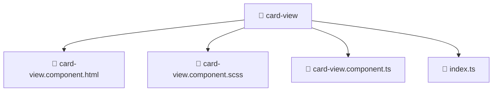

# 📁 card-view

[Root](/.) > [frontend](/frontend) > [src](/frontend/src) > [shared](/frontend/src/shared) > [ui](/frontend/src/shared/ui) > [card-view](/frontend/src/shared/ui/card-view)

## 🎯 Purpose
Delivering luxury-tier architectural components and high-performance logic for the **card-view** domain. This directory is a crucial part of the Mavluda Beauty full-stack ecosystem, ensuring seamless scalability, robust performance, and an elite digital experience.

## 🏗️ Architecture


## 📄 File Registry
| File Name | Type | Responsibility | Key Aliases Used |
|---|---|---|---|
| `card-view.component.html` | HTML | Handles logic and definitions for card-view.component.html | None |
| `card-view.component.scss` | SCSS | Handles logic and definitions for card-view.component.scss | None |
| `card-view.component.ts` | TypeScript | Handles logic and definitions for card-view.component.ts | @angular/common, @environments/environment, @shared/lib |
| `index.ts` | TypeScript | Handles logic and definitions for index.ts | None |

## 🔗 Dependencies
- `@angular/common`
- `@environments/environment`
- `@shared/lib`

## 🛠️ Usage
```typescript
// Example usage within the Mavluda Beauty ecosystem
import { relevantMember } from './card-view';

// Integrate into the application architecture
relevantMember.execute();
```
