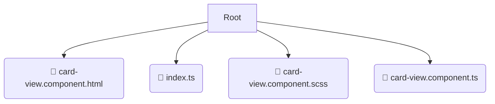

# 📂 card-view

*Breadcrumbs:* [frontend](/frontend) / [src](/frontend/src) / [shared](/frontend/src/shared) / [ui](/frontend/src/shared/ui) / [card-view](/frontend/src/shared/ui/card-view)

## 🎯 PURPOSE
This directory `card-view` is an integral part of the Mavluda Beauty ecosystem. (FSD Layer: Shared) It provides reusable utilities, UI components, and infrastructure agnostic of business logic.
This directory is meticulously maintained to uphold the 'Luxury Professional' standards of the Mavluda Beauty brand.

## 🏗️ ARCHITECTURE


## 📄 FILE REGISTRY
| File Name | Type | Responsibility | Key Aliases Used |
|---|---|---|---|
| `card-view.component.html` | `html` | UI Template | `None` |
| `index.ts` | `ts` | Core functionality | `None` |
| `card-view.component.scss` | `scss` | Styling | `None` |
| `card-view.component.ts` | `ts` | UI Component logic | `@environments/environment, @angular/core, @shared/lib...` |

## 🔗 DEPENDENCIES
- `@environments/environment`
- `@angular/core`
- `@shared/lib`
- `@angular/common`

## 🛠️ USAGE
```typescript
// Example placeholder for interacting with the card-view module
import { example } from './card-view.component.html';
```
