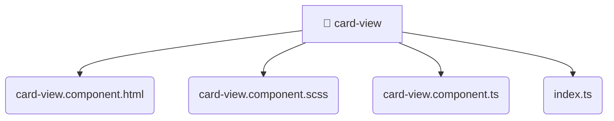

# [frontend](/frontend) / [src](/frontend/src) / [shared](/frontend/src/shared) / [ui](/frontend/src/shared/ui) / [card-view](/frontend/src/shared/ui/card-view)

## 🏷️ 📁 Card-view

### 🎯 PURPOSE
The `card-view` directory forms a critical foundation within the Mavluda Beauty ecosystem, meticulously orchestrating the card-view logic to ensure a seamless and premium experience. Integrated within our cutting-edge Angular frontend architecture, it crafts an elegant, highly-responsive user interface reflecting our luxury brand standards. This module is a distinguished component of the **Shared** layer under the Feature Sliced Design (FSD) methodology.

### 🏗️ ARCHITECTURE


### 📄 FILE REGISTRY
| File Name | Type | Responsibility | Key Aliases Used |
|---|---|---|---|
| `card-view.component.html` | `html` | Encapsulates premium logic and definitions for `card-view.component.html`. | None |
| `card-view.component.scss` | `scss` | Encapsulates premium logic and definitions for `card-view.component.scss`. | None |
| `card-view.component.ts` | `ts` | Encapsulates premium logic and definitions for `card-view.component.ts`. | @environments/environment, @angular/core, @shared/lib, @angular/common |
| `index.ts` | `ts` | Encapsulates premium logic and definitions for `index.ts`. | None |


### 🔗 DEPENDENCIES
- `@angular/common`
- `@angular/core`
- `@environments/environment`
- `@shared/lib`

### 🛠️ USAGE
```typescript
// Seamlessly integrate card-view into your refined workflows:
import { /* exported members */ } from '@path/to/card-view';
```
