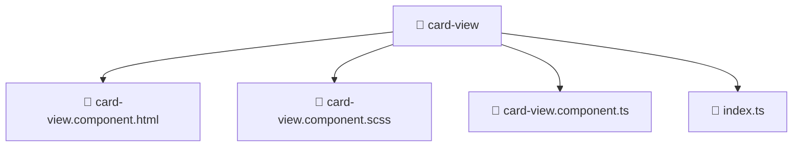

# 📁 card-view

[Root](/.) > [frontend](/frontend) > [src](/frontend/src) > [shared](/frontend/src/shared) > [ui](/frontend/src/shared/ui) > [card-view](/frontend/src/shared/ui/card-view)

**FSD Layer:** Shared

## 🎯 Purpose
Frontend UI components containing template structures, styling, and specific behavioral logic.

## 🏗️ Architecture


## 📄 File Registry
| File Name | Type | Responsibility | Key Aliases Used |
|---|---|---|---|
| `card-view.component.html` | Template | Structural template and layout for card-view.component.html. | N/A |
| `card-view.component.scss` | Stylesheet | Luxury styling and visual presentation for card-view.component.scss. | N/A |
| `card-view.component.ts` | TypeScript | UI component logic and state management for card-view.component.ts. | @angular, @environments, @shared |
| `index.ts` | TypeScript | Provides core logic and orchestration for index.ts. | N/A |

## 🔗 Dependencies
- `@angular/common`
- `@environments/environment`
- `@shared/lib`

## 🛠️ Usage
```html
<!-- Example usage in a parent component template -->
<app-component-selector></app-component-selector>
```
