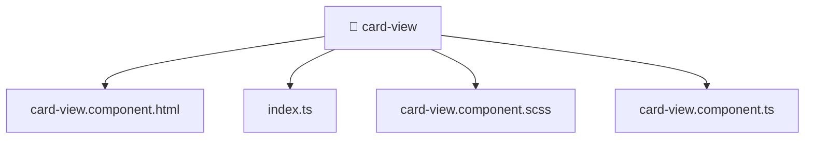

[🏠 Home](../../../../../README.md) > [frontend](../../../../README.md) > [src](../../../README.md) > [shared](../../README.md) > [ui](../README.md) > [card-view](./README.md)

# 📁 card-view

**FSD Layer:** `Shared`

### 🎯 PURPOSE
Welcome to the exquisite **card-view** module of the Mavluda Beauty ecosystem. This directory focuses on orchestrating UI Components. It is designed adhering to our 'Luxury Professional' standards.

### 🏗️ ARCHITECTURE


### 📄 FILE REGISTRY
| File Name | Type | Responsibility | Key Aliases Used |
|---|---|---|---|
| `card-view.component.html` | HTML Template | Provides logic and definitions for card-view.component.html. | None |
| `card-view.component.scss` | Stylesheet | Provides logic and definitions for card-view.component.scss. | None |
| `card-view.component.ts` | Angular Component | Defines a UI component and its logic Defines classes: CardViewComponent. | @environments, @angular, @shared |
| `index.ts` | TypeScript File | Exports or orchestrates module members. | None |

### 🔗 DEPENDENCIES
- `@angular/common`
- `@environments/environment`
- `@shared/lib`

### 🛠️ USAGE
```typescript
// Example interaction or integration snippet
import { utility } from '@shared/path';
```
