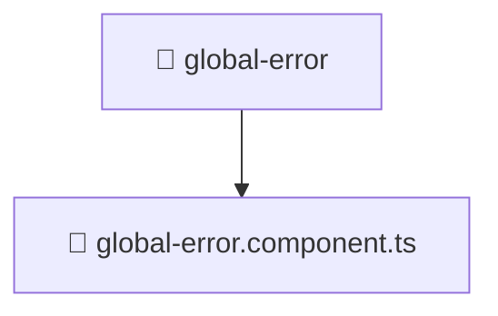

### 🧭 Breadcrumbs
[Root](/) > [frontend](/frontend) > [src](/frontend/src) > [shared](/frontend/src/shared) > [ui](/frontend/src/shared/ui) > [global-error](/frontend/src/shared/ui/global-error)

# 📁 Global-error Directory
**Architecture Layer:** Shared Layer

## 🎯 Purpose
Provides luxury professional architectural implementation for the global-error module within the Mavluda Beauty ecosystem. Ensure robust functionality and elegant integration with the broader architecture.

## 🏗️ ARCHITECTURE


## 📄 FILE REGISTRY
| File Name | Type | Responsibility | Key Aliases Used |
|---|---|---|---|
| `global-error.component.ts` | TypeScript | UI component logic and state management for global-error.component.ts. | @angular/core, @angular/animations, @shared/services, @angular/common |

## 🔗 DEPENDENCIES
- `@angular/animations`
- `@angular/common`
- `@angular/core`
- `@shared/services`

## 🛠️ USAGE
```typescript
// Example architectural integration for global-error
// Utilize the exported members according to Mavluda Beauty's standard conventions.
```

---
*Maintained by Mavluda Beauty - Architecture & Engineering*

---
*Maintained by Mavluda Beauty - Architecture & Engineering*