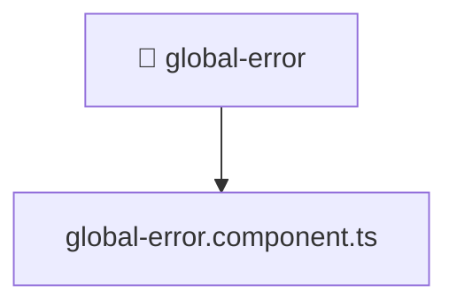

[🏠 Home](../../../../../README.md) > [frontend](../../../../README.md) > [src](../../../README.md) > [shared](../../README.md) > [ui](../README.md) > [global-error](./README.md)

# 📁 global-error

**FSD Layer:** `Shared`

### 🎯 PURPOSE
Welcome to the exquisite **global-error** module of the Mavluda Beauty ecosystem. This directory focuses on orchestrating UI Components. It is designed adhering to our 'Luxury Professional' standards.

### 🏗️ ARCHITECTURE


### 📄 FILE REGISTRY
| File Name | Type | Responsibility | Key Aliases Used |
|---|---|---|---|
| `global-error.component.ts` | Angular Component | Defines a UI component and its logic Defines classes: GlobalErrorComponent. | @angular, @shared |

### 🔗 DEPENDENCIES
- `@angular/animations`
- `@angular/common`
- `@angular/core`
- `@shared/services`

### 🛠️ USAGE
```typescript
// Example interaction or integration snippet
import { utility } from '@shared/path';
```
