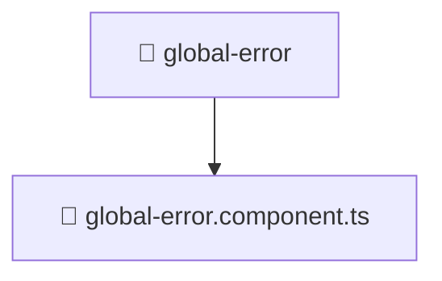

# 📁 global-error

[Root](/.) > [frontend](/frontend) > [src](/frontend/src) > [shared](/frontend/src/shared) > [ui](/frontend/src/shared/ui) > [global-error](/frontend/src/shared/ui/global-error)

**FSD Layer:** Shared

## 🎯 Purpose
Delivering luxury-tier architectural components and logic for the **global-error** domain. Ensuring seamless scalability, robust performance, and an elite digital experience in the Mavluda Beauty ecosystem.

## 🏗️ Architecture


## 📄 File Registry
| File Name | Type | Responsibility | Key Aliases Used |
|---|---|---|---|
| `global-error.component.ts` | TypeScript | UI component logic and state management for global-error.component.ts. | @angular, @shared |

## 🔗 Dependencies
- `@angular/animations`
- `@angular/common`
- `@angular/core`
- `@shared/services`

## 🛠️ Usage
```typescript
// Example usage within the Mavluda Beauty ecosystem
import { relevantMember } from './';
```
