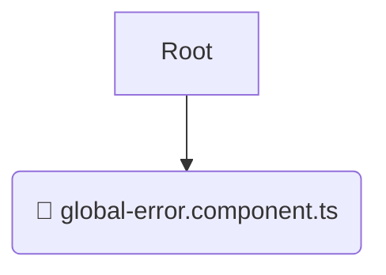

# 📂 global-error

*Breadcrumbs:* [frontend](/frontend) / [src](/frontend/src) / [shared](/frontend/src/shared) / [ui](/frontend/src/shared/ui) / [global-error](/frontend/src/shared/ui/global-error)

## 🎯 PURPOSE
This directory `global-error` is an integral part of the Mavluda Beauty ecosystem. (FSD Layer: Shared) It provides reusable utilities, UI components, and infrastructure agnostic of business logic.
This directory is meticulously maintained to uphold the 'Luxury Professional' standards of the Mavluda Beauty brand.

## 🏗️ ARCHITECTURE


## 📄 FILE REGISTRY
| File Name | Type | Responsibility | Key Aliases Used |
|---|---|---|---|
| `global-error.component.ts` | `ts` | UI Component logic | `@angular/core, @shared/services, @angular/common...` |

## 🔗 DEPENDENCIES
- `@angular/core`
- `@shared/services`
- `@angular/common`
- `@angular/animations`

## 🛠️ USAGE
```typescript
// Example placeholder for interacting with the global-error module
import { example } from './global-error.component.ts';
```
