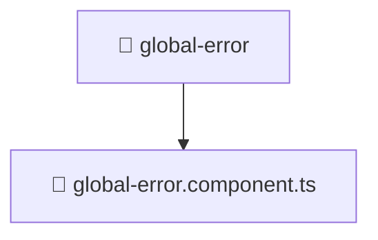

<!--
Mavluda Beauty - Luxury Professional Documentation
Generated for 100% Architectural Transparency
-->
[Home](../../../../../README.md) > [frontend](../../../../README.md) > [src](../../../README.md) > [shared](../../README.md) > [ui](../README.md) > [global-error](./README.md)

# 📁 GLOBAL-ERROR Directory

> **FSD Layer:** Shared

## 🎯 PURPOSE
Contains shared reusable UI components, utilities, and services across the entire application.

## 🏗️ ARCHITECTURE


## 📄 FILE REGISTRY
| File Name | Type | Responsibility | Key Aliases Used |
|---|---|---|---|
| `global-error.component.ts` | TypeScript | UI rendering and component logic. | @angular, @shared |


## 🔗 DEPENDENCIES
- `@angular/core`
- `@angular/common`
- `@shared/services`
- `@angular/animations`

## 🛠️ USAGE
```typescript
// Example placeholder for interacting with global-error
// Consult the individual files in the registry for specific APIs.
```
