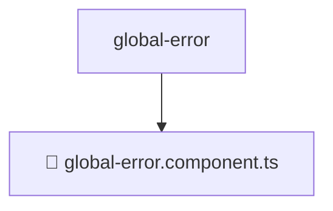

# 📂 GLOBAL-ERROR

> 💎 **Mavluda Beauty - Luxury Professional Architecture**

### 📍 Breadcrumb Navigation
`. > frontend > src > shared > ui > global-error`

## 🎯 PURPOSE
This directory encapsulates `Shared` level functionality within the Mavluda Beauty ecosystem, ensuring proper separation of concerns and architectural transparency.

**FSD / Architecture Layer:** `Shared`

## 🏗️ ARCHITECTURE


## 📄 FILE REGISTRY

| Item Name | Type | Responsibility | Key Aliases Used |
|-----------|------|----------------|------------------|
| `📄 global-error.component.ts` | `.ts` | Component logic | `@angular/core, @angular/common, @angular/animations, @shared/services` |

## 🔗 DEPENDENCIES
- `@angular/core`
- `@angular/common`
- `@angular/animations`
- `@shared/services`

## 🛠️ USAGE
```typescript
// Example usage context
import { ... } from './global-error.component';

// Integrate global-error.component logic into your feature.
```
