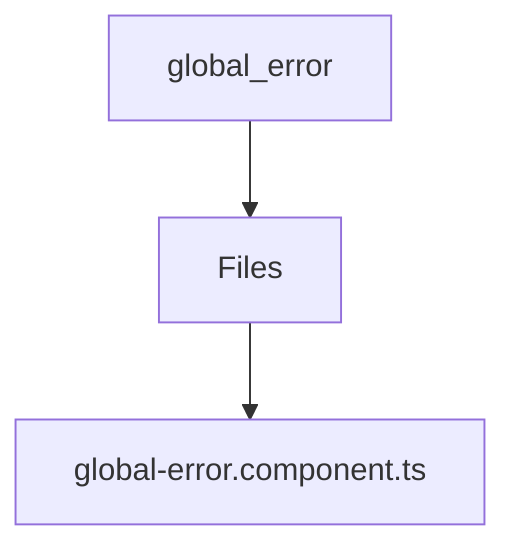

# 🏷️ Global Error Directory

> *Elegance, Precision, and Luxury Professionalism — The Mavluda Beauty Standard.*

## 🧭 Breadcrumb Navigation
[frontend](/frontend) ➔ [src](/frontend/src) ➔ [shared](/frontend/src/shared) ➔ [ui](/frontend/src/shared/ui) ➔ [global-error](/frontend/src/shared/ui/global-error)

## 🎯 Purpose
This directory encapsulates the essential architecture and logic for the **Global Error** domain within the Mavluda Beauty ecosystem. It serves as a foundational component ensuring robust, scalable, and elegant operations.

**Feature Sliced Design (FSD) Layer:** `Shared`

## 🏗️ Architecture


## 📄 File Registry
| File Name | Type | Responsibility | Key Aliases Used |
|---|---|---|---|
| `global-error.component.ts` | TypeScript | Exports: GlobalErrorComponent | @shared |

## 🔗 Dependencies
- `@angular/animations`
- `@angular/common`
- `@angular/core`
- `@shared/services`

## 🛠️ Usage
```typescript
// To utilize the luxurious capabilities of this module:
import { GlobalErrorComponent } from './path/to/globalerrorcomponent';

// Ensure properly typed interactions per Mavluda Beauty standards
```
