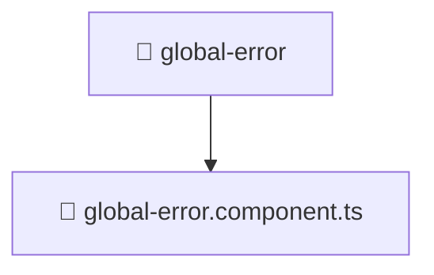

# 📁 global-error

[Root](/.) > [frontend](/frontend) > [src](/frontend/src) > [shared](/frontend/src/shared) > [ui](/frontend/src/shared/ui) > [global-error](/frontend/src/shared/ui/global-error)

## 🎯 Purpose
Delivering luxury-tier architectural components and high-performance logic for the **global-error** domain. This directory is a crucial part of the Mavluda Beauty full-stack ecosystem, ensuring seamless scalability, robust performance, and an elite digital experience.

## 🏗️ Architecture


## 📄 File Registry
| File Name | Type | Responsibility | Key Aliases Used |
|---|---|---|---|
| `global-error.component.ts` | TypeScript | Handles logic and definitions for global-error.component.ts | @angular/animations, @angular/common, @angular/core, @shared/services |

## 🔗 Dependencies
- `@angular/animations`
- `@angular/common`
- `@angular/core`
- `@shared/services`

## 🛠️ Usage
```typescript
// Example usage within the Mavluda Beauty ecosystem
import { relevantMember } from './global-error';

// Integrate into the application architecture
relevantMember.execute();
```
