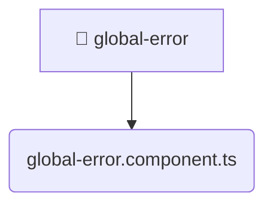

# [frontend](/frontend) / [src](/frontend/src) / [shared](/frontend/src/shared) / [ui](/frontend/src/shared/ui) / [global-error](/frontend/src/shared/ui/global-error)

## 🏷️ 📁 Global-error

### 🎯 PURPOSE
The `global-error` directory forms a critical foundation within the Mavluda Beauty ecosystem, meticulously orchestrating the global-error logic to ensure a seamless and premium experience. Integrated within our cutting-edge Angular frontend architecture, it crafts an elegant, highly-responsive user interface reflecting our luxury brand standards. This module is a distinguished component of the **Shared** layer under the Feature Sliced Design (FSD) methodology.

### 🏗️ ARCHITECTURE


### 📄 FILE REGISTRY
| File Name | Type | Responsibility | Key Aliases Used |
|---|---|---|---|
| `global-error.component.ts` | `ts` | Encapsulates premium logic and definitions for `global-error.component.ts`. | @angular/core, @shared/services, @angular/animations, @angular/common |


### 🔗 DEPENDENCIES
- `@angular/animations`
- `@angular/common`
- `@angular/core`
- `@shared/services`

### 🛠️ USAGE
```typescript
// Seamlessly integrate global-error into your refined workflows:
import { /* exported members */ } from '@path/to/global-error';
```
