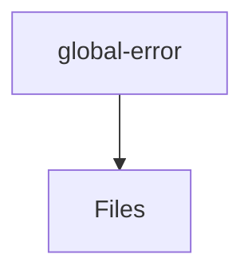

# 📁 Global-Error Directory

[frontend](/frontend) > [src](/frontend/src) > [shared](/frontend/src/shared) > [ui](/frontend/src/shared/ui) > [global-error](/frontend/src/shared/ui/global-error)

## 🎯 Purpose
A high-level module handling `global-error` logic within the Mavluda Beauty ecosystem. This directory adheres to our "Luxury Professional" architectural standards.

**FSD Layer:** Shared


## 🏗️ Architecture



## 📄 File Registry
| File Name | Type | Responsibility | Key Aliases Used |
|-----------|------|----------------|------------------|
| `global-error.component.ts` | Component | Angular UI standalone component logic. | @shared/services, @angular/animations, @angular/core, @angular/common |

## 🔗 Dependencies
- `@angular/animations`
- `@angular/common`
- `@angular/core`
- `@shared/services`

## 🛠️ Usage
```typescript
// Architectural overview snippet
import { InternalLogic } from './internal-file';
// Ensure adherence to Hexagonal / FSD principles
```
