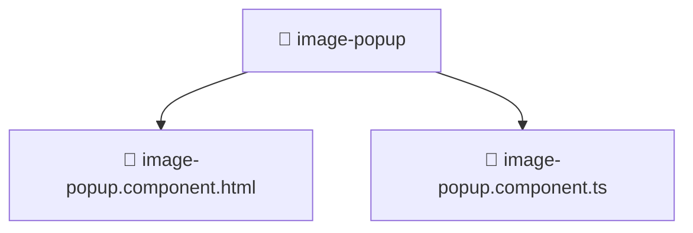

### 🧭 Breadcrumbs
[Root](/) > [frontend](/frontend) > [src](/frontend/src) > [shared](/frontend/src/shared) > [ui](/frontend/src/shared/ui) > [image-popup](/frontend/src/shared/ui/image-popup)

# 📁 Image-popup Directory
**Architecture Layer:** Shared Layer

## 🎯 Purpose
Provides luxury professional architectural implementation for the image-popup module within the Mavluda Beauty ecosystem. Ensure robust functionality and elegant integration with the broader architecture.

## 🏗️ ARCHITECTURE


## 📄 FILE REGISTRY
| File Name | Type | Responsibility | Key Aliases Used |
|---|---|---|---|
| `image-popup.component.html` | HTML Template | Structural template and layout for image-popup.component.html. | N/A |
| `image-popup.component.ts` | TypeScript | UI component logic and state management for image-popup.component.ts. | @angular/core, @angular/common |

## 🔗 DEPENDENCIES
- `@angular/common`
- `@angular/core`

## 🛠️ USAGE
```typescript
// Example architectural integration for image-popup
// Utilize the exported members according to Mavluda Beauty's standard conventions.
```

---
*Maintained by Mavluda Beauty - Architecture & Engineering*

---
*Maintained by Mavluda Beauty - Architecture & Engineering*