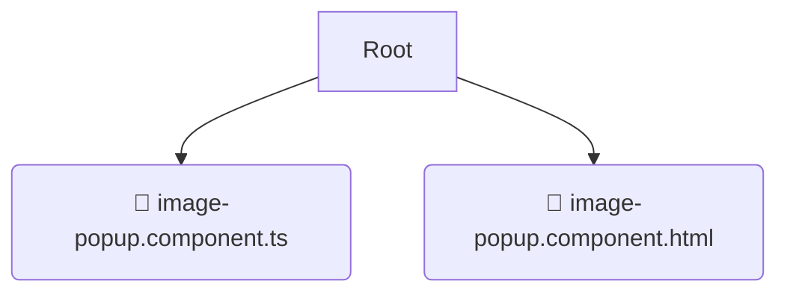

# 📂 image-popup

*Breadcrumbs:* [frontend](/frontend) / [src](/frontend/src) / [shared](/frontend/src/shared) / [ui](/frontend/src/shared/ui) / [image-popup](/frontend/src/shared/ui/image-popup)

## 🎯 PURPOSE
This directory `image-popup` is an integral part of the Mavluda Beauty ecosystem. (FSD Layer: Shared) It provides reusable utilities, UI components, and infrastructure agnostic of business logic.
This directory is meticulously maintained to uphold the 'Luxury Professional' standards of the Mavluda Beauty brand.

## 🏗️ ARCHITECTURE


## 📄 FILE REGISTRY
| File Name | Type | Responsibility | Key Aliases Used |
|---|---|---|---|
| `image-popup.component.ts` | `ts` | UI Component logic | `@angular/core, @angular/common` |
| `image-popup.component.html` | `html` | UI Template | `None` |

## 🔗 DEPENDENCIES
- `@angular/core`
- `@angular/common`

## 🛠️ USAGE
```typescript
// Example placeholder for interacting with the image-popup module
import { example } from './image-popup.component.ts';
```
