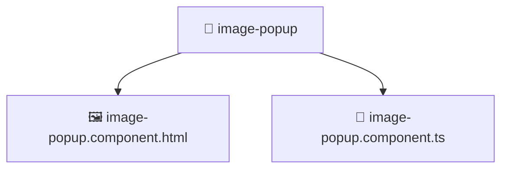

# 📁 image-popup

[Root](/../../../../../README.md) / [frontend](../../../../README.md) / [src](../../../README.md) / [shared](../../README.md) / [ui](../README.md) / [image-popup](./README.md)

## 🎯 Purpose
Delivering luxury-tier architectural components and high-performance logic for the **image-popup** domain. This directory is a crucial part of the Mavluda Beauty full-stack ecosystem, ensuring seamless scalability, robust performance, and an elite digital experience.

**FSD Layer:** Shared

## 🏗️ Architecture


## 📄 File Registry
| File Name | Type | Responsibility | Key Aliases Used |
|---|---|---|---|
| `image-popup.component.html` | Template | Structural template and layout for image-popup.component.html. | N/A |
| `image-popup.component.ts` | Component | UI component logic and state management for image-popup.component.ts. | @angular |


## 🔗 Dependencies
**Internal / Aliases:**
- `@angular/common`
- `@angular/core`


## 🛠️ Usage
```typescript
// Example usage within the Mavluda Beauty ecosystem
import { relevantMember } from './image-popup.component';

// Integrate into the application architecture
relevantMember.execute();
```
