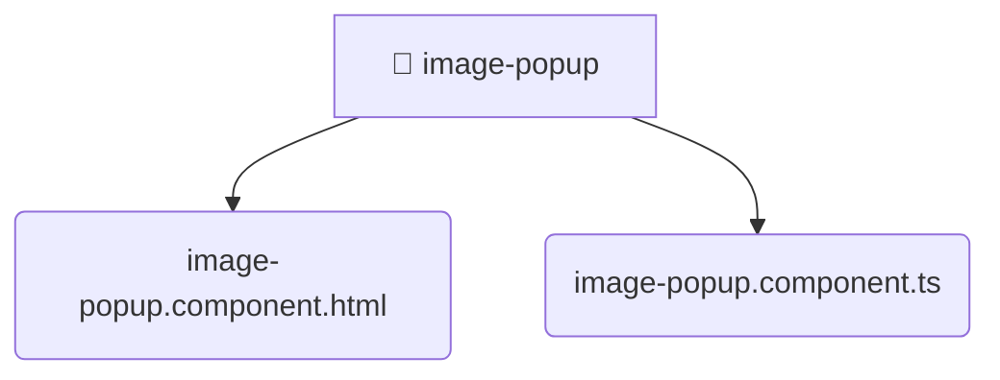

# [root](/) / [frontend](/frontend) / [src](/frontend/src) / [shared](/frontend/src/shared) / [ui](/frontend/src/shared/ui) / [image-popup](/frontend/src/shared/ui/image-popup)

## 🏷️ 📁 Image-popup (Shared Layer)

### 🎯 PURPOSE
The `image-popup` shared module provides reusable UI components and utilities across the frontend.

### 🏗️ ARCHITECTURE


### 📄 FILE REGISTRY
| File Name | Type | Responsibility | Key Aliases Used |
|---|---|---|---|
| `image-popup.component.html` | `html` | UI template and styling. | None |
| `image-popup.component.ts` | `ts` | UI component logic and rendering. | @angular |

### 🔗 DEPENDENCIES
- `@angular/common`
- `@angular/core`

### 🛠️ USAGE
```typescript
// Seamlessly integrate image-popup into your refined workflows:
import { /* exported members */ } from '@path/to/image-popup';
```
