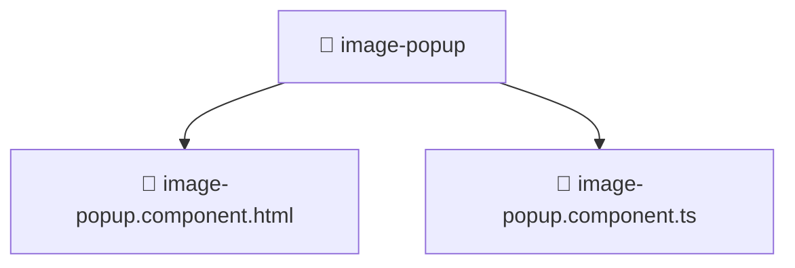

# 📁 image-popup

[Root](/.) > [frontend](/frontend) > [src](/frontend/src) > [shared](/frontend/src/shared) > [ui](/frontend/src/shared/ui) > [image-popup](/frontend/src/shared/ui/image-popup)

## 🎯 Purpose
Delivering luxury-tier architectural components and high-performance logic for the **image-popup** domain. This directory is a crucial part of the Mavluda Beauty full-stack ecosystem, ensuring seamless scalability, robust performance, and an elite digital experience.
> **FSD Layer:** Shared - Adhering to strict Feature Sliced Design architectural constraints.

## 🏗️ Architecture


## 📄 File Registry
| File Name | Type | Responsibility | Key Aliases Used |
|---|---|---|---|
| `image-popup.component.html` | Template | Visual layout and structural HTML. | N/A |
| `image-popup.component.ts` | Component | UI rendering and component-level state. | @angular |


## 🔗 Dependencies
- `@angular/core`
- `@angular/common`

## 🛠️ Usage
```typescript
// Example usage within the Mavluda Beauty ecosystem
import { relevantMember } from './image-popup.component';

// Integrate into the application architecture
relevantMember.execute();
```
