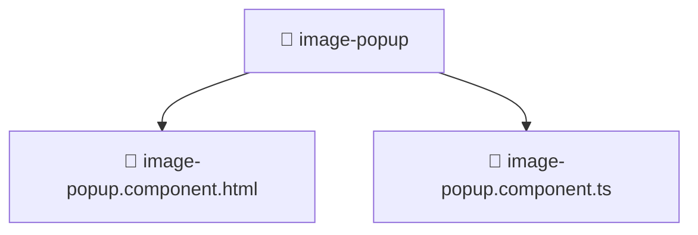

<!--
Mavluda Beauty - Luxury Professional Documentation
Generated for 100% Architectural Transparency
-->
[Home](../../../../../README.md) > [frontend](../../../../README.md) > [src](../../../README.md) > [shared](../../README.md) > [ui](../README.md) > [image-popup](./README.md)

# 📁 IMAGE-POPUP Directory

> **FSD Layer:** Shared

## 🎯 PURPOSE
Contains shared reusable UI components, utilities, and services across the entire application.

## 🏗️ ARCHITECTURE


## 📄 FILE REGISTRY
| File Name | Type | Responsibility | Key Aliases Used |
|---|---|---|---|
| `image-popup.component.html` | HTML Template | UI rendering and component logic. | - |
| `image-popup.component.ts` | TypeScript | UI rendering and component logic. | @angular |


## 🔗 DEPENDENCIES
- `@angular/core`
- `@angular/common`

## 🛠️ USAGE
```typescript
// Example placeholder for interacting with image-popup
// Consult the individual files in the registry for specific APIs.
```
