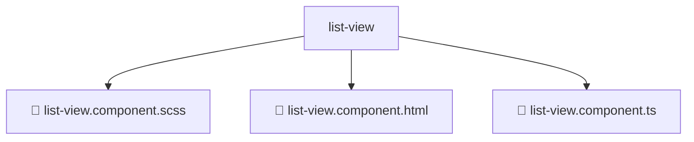

# 📂 LIST-VIEW

> 💎 **Mavluda Beauty - Luxury Professional Architecture**

### 📍 Breadcrumb Navigation
`. > frontend > src > shared > ui > list-view`

## 🎯 PURPOSE
This directory encapsulates `Shared` level functionality within the Mavluda Beauty ecosystem, ensuring proper separation of concerns and architectural transparency.

**FSD / Architecture Layer:** `Shared`

## 🏗️ ARCHITECTURE


## 📄 FILE REGISTRY

| Item Name | Type | Responsibility | Key Aliases Used |
|-----------|------|----------------|------------------|
| `📄 list-view.component.scss` | `.scss` | Component logic | `None` |
| `📄 list-view.component.html` | `.html` | Component logic | `None` |
| `📄 list-view.component.ts` | `.ts` | Component logic | `@angular/core, @angular/common, @shared/lib` |

## 🔗 DEPENDENCIES
- `@angular/core`
- `@angular/common`
- `@shared/lib`

## 🛠️ USAGE
```typescript
// Example usage context
import { ... } from './list-view.component';

// Integrate list-view.component logic into your feature.
```
