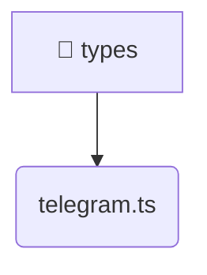

# [root](/) / [frontend](/frontend) / [src](/frontend/src) / [types](/frontend/src/types)

## 🏷️ 📁 Types

### 🎯 PURPOSE
The `types` directory forms a critical foundation within the Mavluda Beauty ecosystem, meticulously orchestrating the types logic to ensure a seamless and premium experience.

### 🏗️ ARCHITECTURE


### 📄 FILE REGISTRY
| File Name | Type | Responsibility | Key Aliases Used |
|---|---|---|---|
| `telegram.ts` | `ts` | Core logic implementation. | None |

### 🔗 DEPENDENCIES
- *Self-contained premium module.*

### 🛠️ USAGE
```typescript
// Seamlessly integrate types into your refined workflows:
import { /* exported members */ } from '@path/to/types';
```
