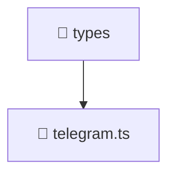

# 📁 types

[Root](/.) > [frontend](/frontend) > [src](/frontend/src) > [types](/frontend/src/types)

## 🎯 Purpose
Delivering luxury-tier architectural components and high-performance logic for the **types** domain. This directory is a crucial part of the Mavluda Beauty full-stack ecosystem, ensuring seamless scalability, robust performance, and an elite digital experience.

## 🏗️ Architecture


## 📄 File Registry
| File Name | Type | Responsibility | Key Aliases Used |
|---|---|---|---|
| `telegram.ts` | File | Core logic and utilities for this domain. | N/A |


## 🔗 Dependencies
- _No external or internal dependencies detected._

## 🛠️ Usage
```typescript
// Example usage within the Mavluda Beauty ecosystem
import { relevantMember } from './telegram';

// Integrate into the application architecture
relevantMember.execute();
```
