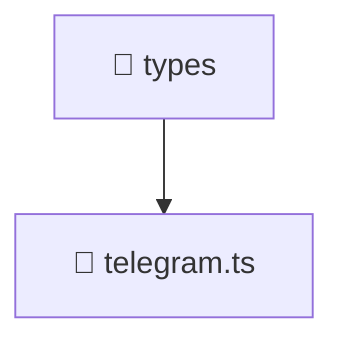

# 📁 types

[Root](/.) > [frontend](/frontend) > [src](/frontend/src) > [types](/frontend/src/types)

## 🎯 Purpose
Delivering luxury-tier architectural components and logic for the **types** domain. Ensuring seamless scalability, robust performance, and an elite digital experience in the Mavluda Beauty ecosystem.

## 🏗️ Architecture


## 📄 File Registry
| File Name | Type | Responsibility | Key Aliases Used |
|---|---|---|---|
| `telegram.ts` | TypeScript | Provides core logic and orchestration for telegram.ts. | N/A |

## 🔗 Dependencies
- No external dependencies.

## 🛠️ Usage
```typescript
// Example usage within the Mavluda Beauty ecosystem
import { relevantMember } from './';
```
