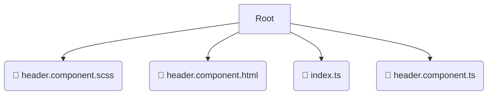

# 📂 header

*Breadcrumbs:* [frontend](/frontend) / [src](/frontend/src) / [widgets](/frontend/src/widgets) / [header](/frontend/src/widgets/header)

## 🎯 PURPOSE
This directory `header` is an integral part of the Mavluda Beauty ecosystem. (FSD Layer: Widgets) It composes entities and features into independent UI blocks.
This directory is meticulously maintained to uphold the 'Luxury Professional' standards of the Mavluda Beauty brand.

## 🏗️ ARCHITECTURE


## 📄 FILE REGISTRY
| File Name | Type | Responsibility | Key Aliases Used |
|---|---|---|---|
| `header.component.scss` | `scss` | Styling | `None` |
| `header.component.html` | `html` | UI Template | `None` |
| `index.ts` | `ts` | Core functionality | `None` |
| `header.component.ts` | `ts` | UI Component logic | `@angular/router, @angular/core, @features/language-selection...` |

## 🔗 DEPENDENCIES
- `@angular/router`
- `@angular/core`
- `@features/language-selection`
- `@angular/common`

## 🛠️ USAGE
```typescript
// Example placeholder for interacting with the header module
import { example } from './header.component.scss';
```
