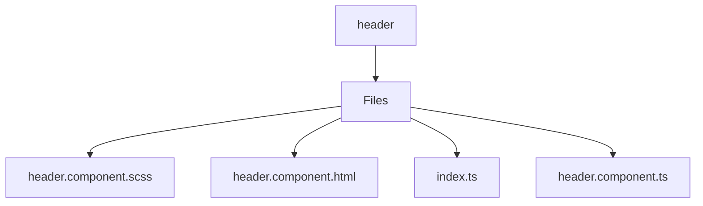

# 🏷️ Header Directory

> *Elegance, Precision, and Luxury Professionalism — The Mavluda Beauty Standard.*

## 🧭 Breadcrumb Navigation
[frontend](/frontend) ➔ [src](/frontend/src) ➔ [widgets](/frontend/src/widgets) ➔ [header](/frontend/src/widgets/header)

## 🎯 Purpose
This directory encapsulates the essential architecture and logic for the **Header** domain within the Mavluda Beauty ecosystem. It serves as a foundational component ensuring robust, scalable, and elegant operations.

**Feature Sliced Design (FSD) Layer:** `Widget`

## 🏗️ Architecture


## 📄 File Registry
| File Name | Type | Responsibility | Key Aliases Used |
|---|---|---|---|
| `header.component.scss` | Stylesheet | Defines logic and structure for header.component.scss. | None |
| `header.component.html` | HTML Template | Defines logic and structure for header.component.html. | None |
| `index.ts` | TypeScript | Defines logic and structure for index.ts. | None |
| `header.component.ts` | TypeScript | Exports: HeaderComponent | @features |

## 🔗 Dependencies
- `@angular/common`
- `@angular/core`
- `@angular/router`
- `@features/language-selection`

## 🛠️ Usage
```typescript
// To utilize the luxurious capabilities of this module:
import { HeaderComponent } from './path/to/headercomponent';

// Ensure properly typed interactions per Mavluda Beauty standards
```
