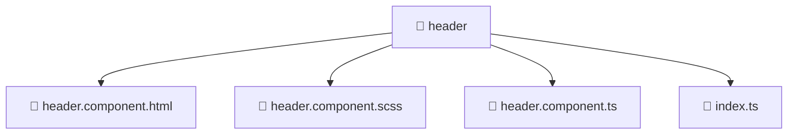

# 📁 header

[Root](/.) > [frontend](/frontend) > [src](/frontend/src) > [widgets](/frontend/src/widgets) > [header](/frontend/src/widgets/header)

**FSD Layer:** Widget

## 🎯 Purpose
Delivering luxury-tier architectural components and high-performance logic for the **header** domain. This directory is a crucial part of the Mavluda Beauty full-stack ecosystem, ensuring seamless scalability, robust performance, and an elite digital experience.

## 🏗️ Architecture


## 📄 File Registry
| File Name | Type | Responsibility | Key Aliases Used |
|---|---|---|---|
| `header.component.html` | Template | Structural template and layout for header.component.html. | N/A |
| `header.component.scss` | Stylesheet | Luxury styling and visual presentation for header.component.scss. | N/A |
| `header.component.ts` | TypeScript | UI component logic and state management for header.component.ts. | @angular, @features |
| `index.ts` | TypeScript | Provides core logic and orchestration for index.ts. | N/A |

## 🔗 Dependencies
- `@angular/common`
- `@angular/core`
- `@angular/router`
- `@features/language-selection`

## 🛠️ Usage
```typescript
// Example usage within the Mavluda Beauty ecosystem
import { relevantMember } from './header';

// Integrate into the application architecture
relevantMember.execute();
```
