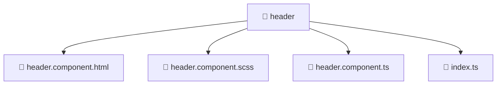

# 📁 Header

[Root](../../../../) > [frontend](../../../) > [src](../../) > [widgets](../) > [header](./)

## 🎯 Purpose
Delivering luxury-tier architectural components and high-performance logic for the **Header** domain. This directory is a crucial part of the Mavluda Beauty full-stack ecosystem, ensuring seamless scalability, robust performance, and an elite digital experience.

**Architecture Layer:** Widgets (Feature Sliced Design / Layered Architecture)

## 🏗️ Architecture


## 📄 File Registry
| File Name | Type | Responsibility | Key Aliases Used |
|---|---|---|---|
| `header.component.html` | HTML Template | Core logic and utilities for this domain. | N/A |
| `header.component.scss` | SCSS Stylesheet | Core logic and utilities for this domain. | N/A |
| `header.component.ts` | TypeScript | Core logic and utilities for this domain. | @features/language-selection, @angular/core, @angular/router, @angular/common |
| `index.ts` | TypeScript | Core logic and utilities for this domain. | N/A |


## 🔗 Dependencies
- `@angular/common`
- `@angular/core`
- `@angular/router`
- `@features/language-selection`

## 🛠️ Usage
```markdown
> This directory acts primarily as a structural container or logic module.
> To interact with its contents, import the relevant exported members from the `index.ts` or specifically targeted files.
```
