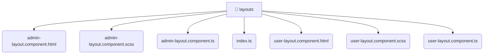

# [root](/) / [frontend](/frontend) / [src](/frontend/src) / [widgets](/frontend/src/widgets) / [layouts](/frontend/src/widgets/layouts)

## 🏷️ 📁 Layouts (Widget Layer)

### 🎯 PURPOSE
The `layouts` directory handles frontend architecture and configuration for the Mavluda Beauty platform.

### 🏗️ ARCHITECTURE


### 📄 FILE REGISTRY
| File Name | Type | Responsibility | Key Aliases Used |
|---|---|---|---|
| `admin-layout.component.html` | `html` | UI template and styling. | None |
| `admin-layout.component.scss` | `scss` | UI template and styling. | None |
| `admin-layout.component.ts` | `ts` | UI component logic and rendering. | @angular, @widgets |
| `index.ts` | `ts` | Core logic implementation. | None |
| `user-layout.component.html` | `html` | UI template and styling. | None |
| `user-layout.component.scss` | `scss` | UI template and styling. | None |
| `user-layout.component.ts` | `ts` | UI component logic and rendering. | @angular |

### 🔗 DEPENDENCIES
- `./admin-layout.component`
- `./user-layout.component`
- `@angular/common`
- `@angular/core`
- `@angular/router`
- `@widgets/header`
- `@widgets/sidebar`

### 🛠️ USAGE
```typescript
// Seamlessly integrate layouts into your refined workflows:
import { /* exported members */ } from '@path/to/layouts';
```
