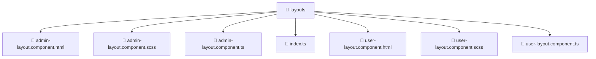

# 📁 Layouts

[Root](/.) > [frontend](/frontend) > [src](/frontend/src) > [widgets](/frontend/src/widgets) > [layouts](/frontend/src/widgets/layouts)

**FSD Layer:** Widgets 🧩

## 🎯 Purpose
Delivering luxury-tier architectural components and high-performance logic for the **layouts** domain. This directory is a crucial part of the Mavluda Beauty full-stack ecosystem, ensuring seamless scalability, robust performance, and an elite digital experience.

## 🏗️ Architecture


## 📄 File Registry
| File Name | Type | Responsibility | Key Aliases Used |
|---|---|---|---|
| `admin-layout.component.html` | Template | Structural template and layout for admin-layout.component.html. | N/A |
| `admin-layout.component.scss` | Stylesheet | Luxury styling and visual presentation for admin-layout.component.scss. | N/A |
| `admin-layout.component.ts` | TypeScript/JavaScript | UI component logic and state management for admin-layout.component.ts. | @angular, @widgets |
| `index.ts` | TypeScript/JavaScript | Provides core logic and orchestration for index.ts. | N/A |
| `user-layout.component.html` | Template | Structural template and layout for user-layout.component.html. | N/A |
| `user-layout.component.scss` | Stylesheet | Luxury styling and visual presentation for user-layout.component.scss. | N/A |
| `user-layout.component.ts` | TypeScript/JavaScript | UI component logic and state management for user-layout.component.ts. | @angular |

## 🔗 Dependencies
- `@angular/common`
- `@angular/core`
- `@angular/router`
- `@widgets/header`
- `@widgets/sidebar`

## 🛠️ Usage
```typescript
// Example usage within the Mavluda Beauty ecosystem
import { relevantMember } from './layouts';

// Integrate into the application architecture
relevantMember.execute();
```
