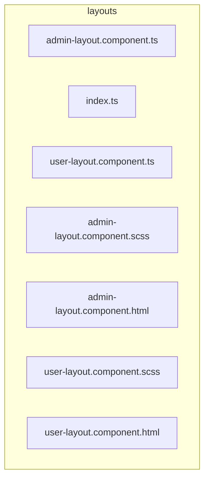

# 📁 layouts

[frontend](../../../README.md) > [src](../../README.md) > [widgets](../README.md) > [layouts](README.md)

---

### 🎯 PURPOSE
Elevating the digital experience for the Mavluda Beauty ecosystem, this module manages the sophisticated Widgets Layer (Independent, complex UI blocks) operations.

*FSD Layer:* **Widgets Layer (Independent, complex UI blocks)**

---

### 🏗️ ARCHITECTURE



---

### 📄 FILE REGISTRY
| File Name | Type | Responsibility | Key Aliases Used |
|-----------|------|----------------|------------------|
| `admin-layout.component.ts` | Component | Handles component logic for Mavluda Beauty's luxury standards. | `@widgets, @angular` |
| `index.ts` | Source | Handles source logic for Mavluda Beauty's luxury standards. | `None` |
| `user-layout.component.ts` | Component | Handles component logic for Mavluda Beauty's luxury standards. | `@angular` |
| `admin-layout.component.scss` | Styles | Handles styles logic for Mavluda Beauty's luxury standards. | `None` |
| `admin-layout.component.html` | Template | Handles template logic for Mavluda Beauty's luxury standards. | `None` |
| `user-layout.component.scss` | Styles | Handles styles logic for Mavluda Beauty's luxury standards. | `None` |
| `user-layout.component.html` | Template | Handles template logic for Mavluda Beauty's luxury standards. | `None` |

---

### 🔗 DEPENDENCIES
**Key Path Aliases Detected:** `@widgets`, `@angular`

Notable imports:
- `@widgets/header`
- `@widgets/sidebar`
- `./user-layout.component`
- `@angular/core`
- `./admin-layout.component`
- `@angular/common`
- `@angular/router`

---

### 🛠️ USAGE
To interact with this directory's luxurious logic, integrate its exported components or services directly into your feature modules. Ensure strict adherence to the Widgets Layer (Independent, complex UI blocks) boundaries.

```typescript
// Example integration snippet
import { FeatureModule } from '@path/to/layouts';
```
