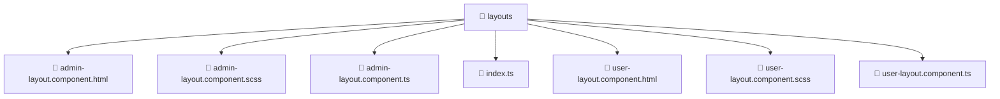

### 🧭 Breadcrumbs
[Root](/) > [frontend](/frontend) > [src](/frontend/src) > [widgets](/frontend/src/widgets) > [layouts](/frontend/src/widgets/layouts)

# 📁 Layouts Directory
**Architecture Layer:** Widget Layer

## 🎯 Purpose
Provides luxury professional architectural implementation for the layouts module within the Mavluda Beauty ecosystem. Ensure robust functionality and elegant integration with the broader architecture.

## 🏗️ ARCHITECTURE


## 📄 FILE REGISTRY
| File Name | Type | Responsibility | Key Aliases Used |
|---|---|---|---|
| `admin-layout.component.html` | HTML Template | Structural template and layout for admin-layout.component.html. | N/A |
| `admin-layout.component.scss` | Stylesheet | Luxury styling and visual presentation for admin-layout.component.scss. | N/A |
| `admin-layout.component.ts` | TypeScript | UI component logic and state management for admin-layout.component.ts. | @angular/core, @widgets/header, @widgets/sidebar, @angular/router |
| `index.ts` | TypeScript | Provides core logic and orchestration for index.ts. | N/A |
| `user-layout.component.html` | HTML Template | Structural template and layout for user-layout.component.html. | N/A |
| `user-layout.component.scss` | Stylesheet | Luxury styling and visual presentation for user-layout.component.scss. | N/A |
| `user-layout.component.ts` | TypeScript | UI component logic and state management for user-layout.component.ts. | @angular/core, @angular/common, @angular/router |

## 🔗 DEPENDENCIES
- `@angular/common`
- `@angular/core`
- `@angular/router`
- `@widgets/header`
- `@widgets/sidebar`

## 🛠️ USAGE
```typescript
// Example architectural integration for layouts
// Utilize the exported members according to Mavluda Beauty's standard conventions.
```

---
*Maintained by Mavluda Beauty - Architecture & Engineering*

---
*Maintained by Mavluda Beauty - Architecture & Engineering*