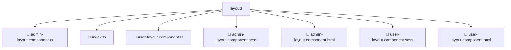

# 📂 LAYOUTS

> 💎 **Mavluda Beauty - Luxury Professional Architecture**

### 📍 Breadcrumb Navigation
`. > frontend > src > widgets > layouts`

## 🎯 PURPOSE
This directory encapsulates `Widgets` level functionality within the Mavluda Beauty ecosystem, ensuring proper separation of concerns and architectural transparency.

**FSD / Architecture Layer:** `Widgets`

## 🏗️ ARCHITECTURE


## 📄 FILE REGISTRY

| Item Name | Type | Responsibility | Key Aliases Used |
|-----------|------|----------------|------------------|
| `📄 admin-layout.component.ts` | `.ts` | Component logic | `@widgets/header, @angular/core, @angular/router, @widgets/sidebar` |
| `📄 index.ts` | `.ts` | General functionality | `None` |
| `📄 user-layout.component.ts` | `.ts` | Component logic | `@angular/core, @angular/router, @angular/common` |
| `📄 admin-layout.component.scss` | `.scss` | Component logic | `None` |
| `📄 admin-layout.component.html` | `.html` | Component logic | `None` |
| `📄 user-layout.component.scss` | `.scss` | Component logic | `None` |
| `📄 user-layout.component.html` | `.html` | Component logic | `None` |

## 🔗 DEPENDENCIES
- `@widgets/header`
- `@angular/core`
- `@widgets/sidebar`
- `@angular/common`
- `@angular/router`

## 🛠️ USAGE
```typescript
// Example usage context
import { ... } from './admin-layout.component';

// Integrate admin-layout.component logic into your feature.
```
