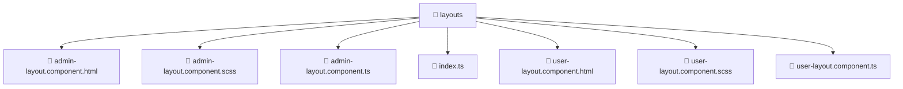

# 📁 layouts

[Root](/.) > [frontend](/frontend) > [src](/frontend/src) > [widgets](/frontend/src/widgets) > [layouts](/frontend/src/widgets/layouts)

**FSD Layer:** Widget

## 🎯 Purpose
Delivering luxury-tier architectural components and high-performance logic for the **Layouts** domain. This directory is a crucial part of the Mavluda Beauty full-stack ecosystem, ensuring seamless scalability, robust performance, and an elite digital experience.

**Architecture Layer:** Widgets (Feature Sliced Design / Layered Architecture)

## 🏗️ Architecture


## 📄 File Registry
| File Name | Type | Responsibility | Key Aliases Used |
|---|---|---|---|
| `admin-layout.component.html` | Template | Core logic and utilities for this domain. | N/A |
| `admin-layout.component.scss` | Stylesheet | Core logic and utilities for this domain. | N/A |
| `admin-layout.component.ts` | TypeScript | Core logic and utilities for this domain. | @angular, @widgets |
| `index.ts` | TypeScript | Core logic and utilities for this domain. | N/A |
| `user-layout.component.html` | Template | Core logic and utilities for this domain. | N/A |
| `user-layout.component.scss` | Stylesheet | Core logic and utilities for this domain. | N/A |
| `user-layout.component.ts` | TypeScript | Core logic and utilities for this domain. | @angular |

## 🔗 Dependencies
- `@angular/common`
- `@angular/core`
- `@angular/router`
- `@widgets/header`
- `@widgets/sidebar`

## 🛠️ Usage
```markdown
```markdown
> This directory acts primarily as a structural container or logic module.
> To interact with its contents, import the relevant exported members from the `index.ts` or specifically targeted files.
```
```
