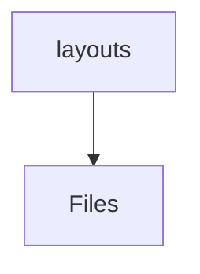

# 📁 Layouts Directory

[frontend](/frontend) > [src](/frontend/src) > [widgets](/frontend/src/widgets) > [layouts](/frontend/src/widgets/layouts)

## 🎯 Purpose
A high-level module handling `layouts` logic within the Mavluda Beauty ecosystem. This directory adheres to our "Luxury Professional" architectural standards.

**FSD Layer:** Widgets


## 🏗️ Architecture



## 📄 File Registry
| File Name | Type | Responsibility | Key Aliases Used |
|-----------|------|----------------|------------------|
| `admin-layout.component.html` | Template | Angular UI standalone component logic. | None |
| `admin-layout.component.scss` | Style | Angular UI standalone component logic. | None |
| `admin-layout.component.ts` | Component | Angular UI standalone component logic. | @widgets/header, @angular/core, @angular/router, @widgets/sidebar |
| `index.ts` | TypeScript | Provides localized typescript definitions. | None |
| `user-layout.component.html` | Template | Angular UI standalone component logic. | None |
| `user-layout.component.scss` | Style | Angular UI standalone component logic. | None |
| `user-layout.component.ts` | Component | Angular UI standalone component logic. | @angular/core, @angular/router, @angular/common |

## 🔗 Dependencies
- `@angular/common`
- `@angular/core`
- `@angular/router`
- `@widgets/header`
- `@widgets/sidebar`

## 🛠️ Usage
```typescript
// Architectural overview snippet
import { InternalLogic } from './internal-file';
// Ensure adherence to Hexagonal / FSD principles
```
