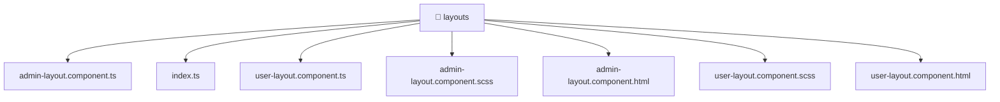

[🏠 Home](../../../../README.md) > [frontend](../../../README.md) > [src](../../README.md) > [widgets](../README.md) > [layouts](./README.md)

# 📁 layouts

**FSD Layer:** `Widgets`

### 🎯 PURPOSE
Welcome to the exquisite **layouts** module of the Mavluda Beauty ecosystem. This directory focuses on orchestrating UI Components. It is designed adhering to our 'Luxury Professional' standards.

### 🏗️ ARCHITECTURE


### 📄 FILE REGISTRY
| File Name | Type | Responsibility | Key Aliases Used |
|---|---|---|---|
| `admin-layout.component.html` | HTML Template | Provides logic and definitions for admin-layout.component.html. | None |
| `admin-layout.component.scss` | Stylesheet | Provides logic and definitions for admin-layout.component.scss. | None |
| `admin-layout.component.ts` | Angular Component | Defines a UI component and its logic Defines classes: AdminLayoutComponent. | @angular, @widgets |
| `index.ts` | TypeScript File | Exports or orchestrates module members. | None |
| `user-layout.component.html` | HTML Template | Provides logic and definitions for user-layout.component.html. | None |
| `user-layout.component.scss` | Stylesheet | Provides logic and definitions for user-layout.component.scss. | None |
| `user-layout.component.ts` | Angular Component | Defines a UI component and its logic Defines classes: UserLayoutComponent. | @angular |

### 🔗 DEPENDENCIES
- `@angular/common`
- `@angular/core`
- `@angular/router`
- `@widgets/header`
- `@widgets/sidebar`

### 🛠️ USAGE
```typescript
// Example interaction or integration snippet
// Import members from layouts based on module boundaries
```
