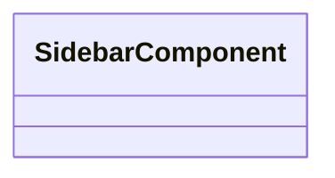

# 📁 Sidebar Directory

[Root](/.) / [frontend](/frontend) / [src](/frontend/src) / [widgets](/frontend/src/widgets) / [sidebar](/frontend/src/widgets/sidebar)

## 🎯 Purpose
Delivering luxury-tier architectural components and high-performance logic for the **sidebar** domain. This directory is a crucial part of the Mavluda Beauty full-stack ecosystem, ensuring seamless scalability, robust performance, and an elite digital experience.
**FSD Layer:** Widgets


## 🏗️ Architecture


## 📄 File Registry
| File Name | Type | Responsibility | Key Aliases Used |
|---|---|---|---|
| `index.ts` | File | Provides core logic and orchestration for index.ts. | N/A |
| `sidebar.component.html` | File | Structural template and layout for sidebar.component.html. | N/A |
| `sidebar.component.ts` | File | UI component logic and state management for sidebar.component.ts. | @angular/router, @shared/pipes, @angular/core, @angular/common |

## 🔗 Dependencies
- Relies on internal Mavluda Beauty architecture and designated FSD layers.
- See 'Key Aliases Used' in the File Registry for explicit cross-domain references.

## 🛠️ Usage
```typescript
// Example usage within the Mavluda Beauty ecosystem
import { relevantMember } from './core';

// Integrate into the application architecture
relevantMember.execute();
```
