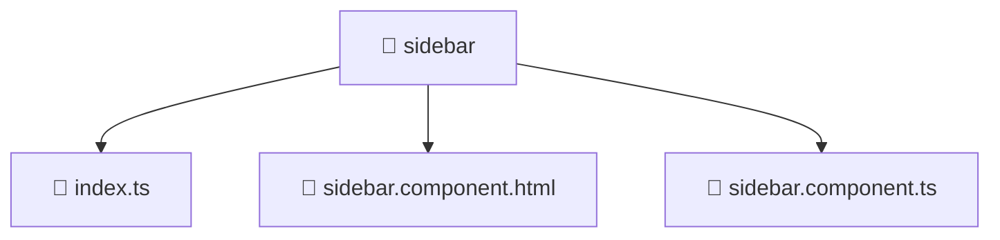

# 📁 sidebar

[Root](/.) > [frontend](/frontend) > [src](/frontend/src) > [widgets](/frontend/src/widgets) > [sidebar](/frontend/src/widgets/sidebar)

**FSD Layer:** Widget

## 🎯 Purpose
Frontend UI components containing template structures, styling, and specific behavioral logic.

## 🏗️ Architecture


## 📄 File Registry
| File Name | Type | Responsibility | Key Aliases Used |
|---|---|---|---|
| `index.ts` | TypeScript | Provides core logic and orchestration for index.ts. | N/A |
| `sidebar.component.html` | Template | Structural template and layout for sidebar.component.html. | N/A |
| `sidebar.component.ts` | TypeScript | UI component logic and state management for sidebar.component.ts. | @angular, @shared |

## 🔗 Dependencies
- `@angular/common`
- `@angular/core`
- `@angular/router`
- `@shared/pipes`
- `rxjs`

## 🛠️ Usage
```html
<!-- Example usage in a parent component template -->
<app-component-selector></app-component-selector>
```
