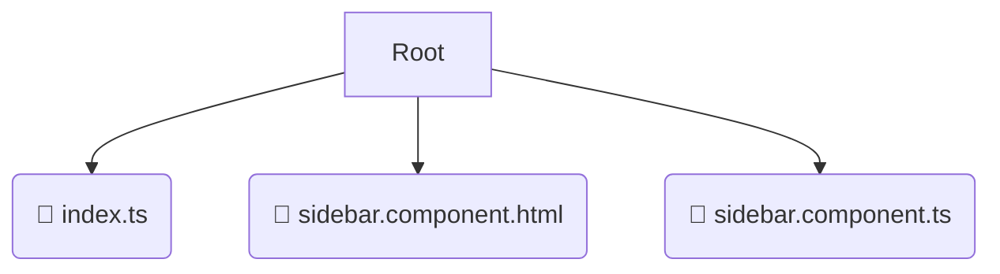

# 📂 sidebar

*Breadcrumbs:* [frontend](/frontend) / [src](/frontend/src) / [widgets](/frontend/src/widgets) / [sidebar](/frontend/src/widgets/sidebar)

## 🎯 PURPOSE
This directory `sidebar` is an integral part of the Mavluda Beauty ecosystem. (FSD Layer: Widgets) It composes entities and features into independent UI blocks.
This directory is meticulously maintained to uphold the 'Luxury Professional' standards of the Mavluda Beauty brand.

## 🏗️ ARCHITECTURE


## 📄 FILE REGISTRY
| File Name | Type | Responsibility | Key Aliases Used |
|---|---|---|---|
| `index.ts` | `ts` | Core functionality | `None` |
| `sidebar.component.html` | `html` | UI Template | `None` |
| `sidebar.component.ts` | `ts` | UI Component logic | `@angular/router, @angular/core, @angular/common...` |

## 🔗 DEPENDENCIES
- `@angular/router`
- `@angular/core`
- `@angular/common`
- `@shared/pipes`

## 🛠️ USAGE
```typescript
// Example placeholder for interacting with the sidebar module
import { example } from './index.ts';
```
