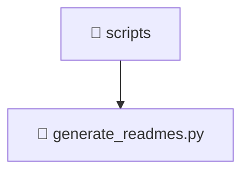

# 📁 scripts

[Root](/.) > [scripts](/scripts)

## 🎯 Purpose
Delivering luxury-tier architectural components and logic for the **scripts** domain. Ensuring seamless scalability, robust performance, and an elite digital experience in the Mavluda Beauty ecosystem.

## 🏗️ Architecture

## 📄 File Registry
| File Name | Type | Responsibility | Key Aliases Used |
|---|---|---|---|
| `generate_readmes.py` | File | Provides core logic and orchestration for generate_readmes.py. | N/A |

## 🔗 Dependencies
- No external dependencies.

## 🛠️ Usage
> No specific code execution examples for this directory.
